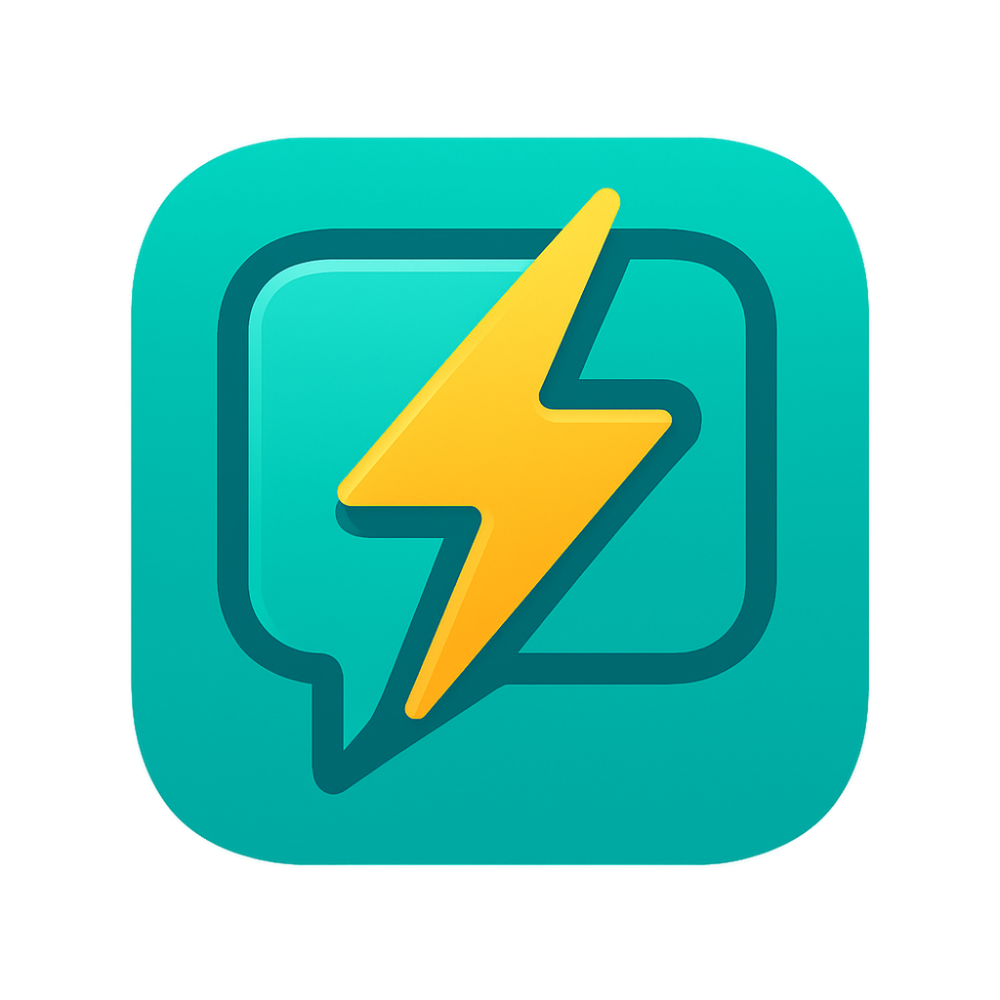

# SwiftLing - Language Learning App

SwiftLing is a responsive, interactive web application designed to help users learn new languages efficiently through phrase management, adaptive quizzes, and progress tracking.



## Features

### Multi-language Support
- Learn phrases and vocabulary across multiple languages
- Full support for all major world languages
- Customizable language selection for both source and target languages

### Personalized Phrase Management
- Add, edit, and organize phrases with detailed information
- Tag system for categorizing phrases (up to 3 tags per phrase)
- Add notes and context to phrases
- Track learning progress for each phrase

### Interactive Learning
- Adaptive quiz system that adjusts difficulty based on performance
- Multiple quiz types including multiple choice, typing, and flashcards
- Customizable timer settings for personalized learning pace
- Performance tracking and analytics

### User Experience
- Responsive design that works seamlessly on desktop, tablet, and mobile
- Dark/light mode support
- Real-time form validation
- Intuitive navigation and user interface

## Tech Stack

### Frontend
- React with TypeScript
- Tailwind CSS for styling
- Shadcn UI components
- Wouter for lightweight routing

### Backend
- Express.js server
- RESTful API architecture
- Drizzle ORM with PostgreSQL

## Getting Started

### Prerequisites
- Node.js (v16 or higher)
- npm or yarn
- PostgreSQL (optional, in-memory storage available for development)

### Installation

1. Clone the repository
```bash
git clone https://github.com/yourusername/swiftling.git
cd swiftling
```

2. Install dependencies
```bash
npm install
```

3. Start the development server
```bash
npm run dev
```

The application will be available at [http://localhost:5000](http://localhost:5000)

### Development Scripts

- `npm run dev` - Start both frontend and backend development servers
- `npm run build` - Build the application for production
- `npm run lint` - Run ESLint to check code quality
- `npm run test` - Run tests (when implemented)

## Project Structure

```
/
├── client/                # Frontend application
│   ├── src/
│   │   ├── components/    # Reusable UI components
│   │   ├── context/       # React Context providers
│   │   ├── hooks/         # Custom React hooks
│   │   ├── lib/           # Utility functions and constants
│   │   ├── pages/         # Page components for each route
│   │   └── main.tsx       # Application entry point
├── server/                # Backend Express server
│   ├── index.ts           # Server entry point
│   ├── routes.ts          # API route definitions
│   ├── storage.ts         # Data storage interface
│   └── vite.ts            # Vite development server setup
├── shared/                # Shared code between frontend and backend
│   └── schema.ts          # Database schema and types
└── package.json           # Project dependencies and scripts
```

## User Flow

1. **Authentication**
   - Sign up with email verification
   - Log in to access personalized content
   - Password recovery

2. **Account Setup**
   - Select languages of interest
   - Configure quiz preferences
   - Customize profile

3. **Learning**
   - Add new phrases to your personal collection
   - Practice with adaptive quizzes
   - Review progress on the dashboard
   - Track performance history

## Contributing

Contributions are welcome! Please feel free to submit a Pull Request.

1. Fork the repository
2. Create your feature branch (`git checkout -b feature/amazing-feature`)
3. Commit your changes (`git commit -m 'Add some amazing feature'`)
4. Push to the branch (`git push origin feature/amazing-feature`)
5. Open a Pull Request

## License

This project is licensed under the MIT License - see the LICENSE file for details.

## Contact

For support or inquiries, please contact: support@swiftlingapp.com